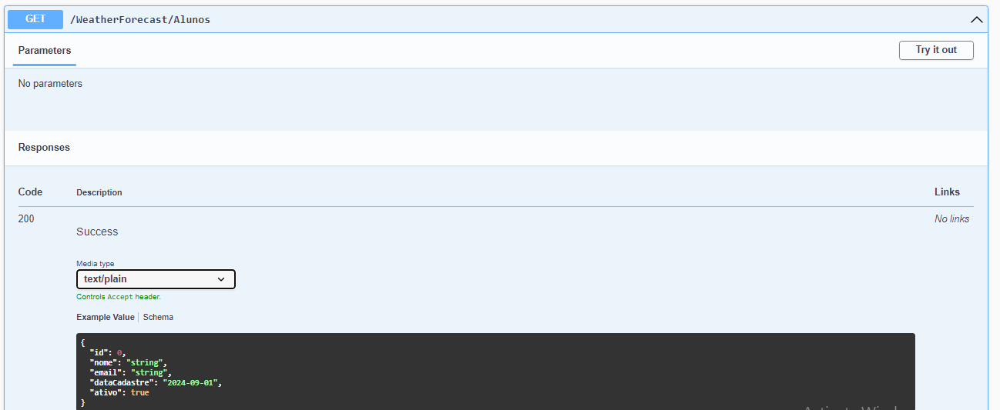
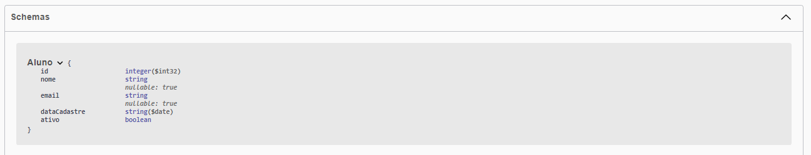

# Iniciando com ASP.NET Web API

Este projeto tem como objetivo fornecer uma introdução prática ao desenvolvimento de APIs RESTful utilizando 
o **ASP.NET Core Web API**. Nele, você aprenderá a criar uma API do zero, configurar rotas, manipular dados, 
e implementar as melhores práticas para construir aplicações web robustas e escaláveis.

## Índice

- [Pré-requisitos](#pré-requisitos)
- [Instalação](#instalação)
- [Primeiros Passos](#primeiros-passos)
- [Construindo a API](#construindo-a-api)
- [Testando a API](#testando-a-api)

<br>



<br>

## Pré-requisitos

Antes de começar, certifique-se de ter o seguinte instalado em sua máquina:

- [Visual Studio Community](https://visualstudio.microsoft.com/pt-br/vs/community/) (ou uma IDE compatível)
- [.NET SDK](https://dotnet.microsoft.com/download)
- Conhecimento básico de C# e conceitos de API REST

## Instalação

Siga os passos abaixo para configurar e executar o projeto localmente:

1. Clone o repositório para a sua máquina local:

    ```bash
    git clone https://github.com/seu-usuario/seu-repositorio.git
    ```

2. Navegue até o diretório do projeto:

    ```bash
    cd DemoWebAPI
    ```

3. Abra o projeto no Visual Studio Community.

4. Restaure as dependências e compile o projeto:

    ```bash
    dotnet restore
    dotnet build
    ```

5. Execute o projeto:

    ```bash
    dotnet run
    ```

## Primeiros Passos
Este projeto foi projetado para ser simples de entender, mas poderoso o suficiente para demonstrar
os principais conceitos do ASP.NET Web API. Você começará criando modelos e controladores básicos, e 
depois adicionará camadas de serviço e repositório para uma melhor organização do código.

## Construindo a API
A construção da API envolve as seguintes etapas:

1. Criando Modelos: Definindo as entidades que serão manipuladas pela API.
2. Configurando Controladores: Criando os endpoints para expor as funcionalidades da API.
3. Implementando Serviços: Criando a lógica de negócio.
4. Cada etapa é detalhada em tutoriais dentro do próprio código do projeto, ajudando você a entender cada 
conceito à medida que o implementa.

## Testando a API
Para testar a API, você pode utilizar ferramentas como o Postman ou o Swagger, que está integrado ao projeto. 
Com essas ferramentas, você pode simular requisições HTTP e verificar se a API está respondendo conforme o 
esperado.

<br>


